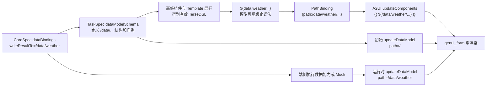

# A2UI 数据绑定端到端实现

## 1. 文档目的

本文说明高级组件如何声明端侧数据、如何把 TerseDSL-Nested-2 中的
`${data.weather.current.temperatureText}` 转换成鸿蒙扩展 A2UI 数据绑定，以及端侧如何通过
`genui_form` 更新 DataModel 并触发组件重渲染。

本文覆盖以下三个代码仓库：

| 仓库 | 主要职责 |
| --- | --- |
| `CreateMyCard` | 生成 CardSpec、TaskSpec、有效 TerseDSL 和最终 A2UI Artifact |
| `intermediate_expression` | 提供 TerseDSL-Nested-2 到 UI IR、A2UI PathBinding 的协议实现 |
| `genui_evaluation` | 下载 Artifact，通过 `genui_form` 注入端侧 Mock 数据并验证重渲染 |

数据绑定分为两个阶段：

- **生成期绑定**：建立“组件属性读取哪个 DataModel 路径”的关系。
- **运行期刷新**：端侧获得真实数据或 Mock 数据后，更新该路径的值。

生成期不会调用天气、日历等端侧能力；运行期也不需要重新请求云侧生成卡片。

## 2. 总体链路



链路中的三个路径必须保持一致：

```text
TaskSpec 叶子路径
    /data/weather/current/temperatureText

TerseDSL 占位值
    ${data.weather.current.temperatureText}

A2UI PathBinding
    /data/weather/current/temperatureText
```

CardSpec 的 `writeResultTo` 通常是能力返回对象的根路径，例如 `/data/weather`。
组件可以读取该根路径下的叶子。

## 3. CardSpec 与 TaskSpec 的分工

### 3.1 CardSpec：声明数据从哪里来、写到哪里

CardSpec 是端侧可执行的数据获取契约。天气数据绑定示例：

```json
{
  "dataBindings": [
    {
      "capabilityId": "GetWeatherInfo",
      "arguments": {
        "cityCode": "60814"
      },
      "writeResultTo": "/data/weather"
    }
  ]
}
```

字段含义：

- `capabilityId`：端侧需要调用的数据能力。
- `arguments`：能力调用参数。
- `writeResultTo`：能力返回值写入 A2UI DataModel 的 JSON Pointer。

`writeResultTo` 必须位于 `/data/...` 下。多个绑定不能写入相同路径，
也不能形成父子覆盖关系。

### 3.2 TaskSpec：定义允许使用的数据结构

TaskSpec 的 `dataModelSchema` 是绑定路径的唯一来源。简化示例：

```json
{
  "dataModelSchema": {
    "data": {
      "weather": {
        "location": {
          "districtName": {
            "type": "string",
            "sampleValue": "上海"
          }
        },
        "current": {
          "temperatureText": {
            "type": "string",
            "sampleValue": "26℃"
          },
          "airQuality": {
            "type": "string",
            "sampleValue": "优"
          }
        },
        "daily": [
          {
            "temperatureRangeText": {
              "type": "string",
              "sampleValue": "24℃ / 31℃"
            }
          }
        ]
      }
    }
  }
}
```

服务只允许绑定到 schema 叶子，例如：

```text
/data/weather/location/districtName
/data/weather/current/temperatureText
/data/weather/current/airQuality
/data/weather/daily/0/temperatureRangeText
```

`_advancedSelectors` 是服务内部选择信息，不进入 DataModel，也不会成为合法绑定路径。

## 4. CreateMyCard 服务侧实现

### 4.1 开关只在生产高级组件链路启用

`compile_hybrid_card()` 和 `compile_ux_layout_card()` 增加
`enable_data_bindings` 参数。高级组件生产链路显式传入：

```python
compile_ux_layout_card(
    source,
    task_spec=task_spec,
    contract=contract,
    protocol_profile=protocol_profile,
    registry=registry,
    enable_data_bindings=True,
)
```

兼容入口默认仍为 `False`，避免历史 literal-only 用例被隐式改变。

相关文件：

- `widget_service/cloud/services/advanced_component_pipeline/pipeline.py`
- `widget_service/cloud/services/cardplan_template/compiler.py`

### 4.2 Template 先展开，再做数据绑定

处理顺序固定为：

1. 解析模型返回的 Hybrid Contract。
2. 展开布局高级组件、业务高级组件和局部 Template。
3. 形成只包含标准组件的 Nested-2 组件树。
4. 使用 TaskSpec 将可识别的静态样例值替换成 `${data.*}`。
5. 将最终有效 TerseDSL 转换为 A2UI。

这样 Template 语义不会泄漏到最终 A2UI，数据绑定也不依赖模型猜测展开后的组件 ID。

### 4.3 如何把样例值替换成 `${data.*}`

`bind_task_spec_values()` 遍历 TaskSpec 叶子并建立：

```text
样例值 -> TaskSpec 叶子路径 -> TerseDSL 占位值
```

例如：

```text
"上海"
  -> /data/weather/location/districtName
  -> ${data.weather.location.districtName}
```

服务当前处理：

- `Text` 的第一个内容参数。
- `Progress`、`Checkbox` options 中的 `value`、`total`、`select` 数值语义字段。

只有样例值在 TaskSpec 中唯一时才替换。若多个叶子具有相同样例值，
服务会跳过该值，避免把内容绑定到错误路径。

示例转换前：

```text
Text("上海", "compact-title")
Text("26℃", "title")
```

示例转换后：

```text
Text("${data.weather.location.districtName}", "compact-title")
Text("${data.weather.current.temperatureText}", "title")
```

相关实现：

- `widget_service/cloud/services/terse_dsl_nested2_converter.py`
  - `bind_task_spec_values()`
  - `_unique_task_spec_sample_bindings()`
  - `_collect_task_spec_samples()`

### 4.4 占位值必须独占整个属性值

合法：

```text
Text("${data.weather.current.temperatureText}", "title")
```

不合法或不会被识别为绑定：

```text
Text("当前温度：${data.weather.current.temperatureText}", "title")
Text("${weather.current.temperatureText}", "title")
Text("${data.weather['current'].temperatureText}", "title")
```

当前语法只允许：

```regex
data(.identifier|.arrayIndex)+
```

不支持任意 JavaScript、函数调用、运算表达式或字符串插值。
静态前后缀应拆为相邻 Text，或由端侧返回已经格式化的展示字段。

### 4.5 服务侧确定性转换

服务将完整占位值转换为内部 PathBinding：

```text
${data.weather.current.temperatureText}
```

转换为：

```json
{
  "path": "/data/weather/current/temperatureText"
}
```

转换前先使用 `_task_spec_leaf_paths()` 生成白名单。路径不是 TaskSpec 叶子时直接报错：

```text
Data binding path is not a TaskSpec leaf
```

因此模型不能通过 `${data.unknown.secret}` 引入 TaskSpec 之外的数据。

### 4.6 生成初始 DataModel

服务从 TaskSpec 的 `sampleValue` 构造初始 DataModel，并输出第三条 A2UI 消息：

```json
{
  "version": "v0.9",
  "updateDataModel": {
    "surfaceId": "surface_card",
    "path": "/",
    "value": {
      "data": {
        "weather": {
          "location": {
            "districtName": "上海"
          },
          "current": {
            "temperatureText": "26℃",
            "airQuality": "优"
          },
          "daily": [
            {
              "temperatureRangeText": "24℃ / 31℃"
            }
          ]
        }
      }
    }
  }
}
```

初始 DataModel 用于首帧展示和确定数据结构，不代表卡片安装后的最新业务数据。

## 5. TerseDSL-Nested-2 协议层实现

`intermediate_expression` 提供与 Python 生产转换器一致的协议能力。

### 5.1 Prompt 只暴露允许的数据根路径

协议生成输入增加 `dataPaths`：

```ts
{
  dataPaths: ["/data/weather"]
}
```

Prompt 告知模型：

- 动态值使用完整 `${data.*}` 字符串占位值。
- 只能使用 `dataPaths` 或其子路径。
- 占位值必须独占整个属性值。
- 禁止直接输出 PathBinding、A2UI 表达式或任意代码。

流式运行时会把同一个 `dataPaths` 继续传给增量 lowerer 和 A2UI 校验器，
避免非流式与流式策略漂移。

相关文件：

- `packages/protocols/tersedsl-nested-2/src/prompt-generator.ts`
- `packages/stream-runtime/src/index.ts`

### 5.2 AST 到 UI IR 的转换

`dataBindingPath()` 只识别完整占位值：

```ts
dataBindingPath("${data.weather.current.temperatureText}")
// => "/data/weather/current/temperatureText"
```

随后将字符串 AST 节点转换为 PathBinding 对象：

```ts
{
  kind: "object",
  properties: [
    {
      key: "path",
      value: {
        kind: "string",
        value: "/data/weather/current/temperatureText"
      }
    }
  ]
}
```

它仍然是受限 AST 数据转换，不会执行模型输出。

相关文件：

- `packages/protocols/tersedsl-nested-2/src/to-ui-ir.ts`

### 5.3 A2UI 输出形式

独立 `intermediate_expression` A2UI Adapter 保留规范 PathBinding 对象：

```json
{
  "id": "temperature",
  "component": "Text",
  "content": {
    "path": "/data/weather/current/temperatureText"
  }
}
```

当前 CreateMyCard 生产适配器会将同一个内部 PathBinding 序列化为
鸿蒙扩展 A2UI 表达式字符串：

```json
{
  "id": "temperature",
  "component": "Text",
  "content": "{{ ${/data/weather/current/temperatureText} }}"
}
```

两种线表示都指向同一个 DataModel JSON Pointer，绑定语义相同。
CreateMyCard 部署产物和本次端侧 `genui_form` 验证使用第二种表示。

完整 A2UI JSONL 顺序为：

1. `createSurface`
2. `updateComponents`
3. 初始 `updateDataModel`

顶层 wire `version` 保持 `v0.9`。鸿蒙扩展 Catalog 能力版本不是顶层 wire version。

## 6. 端侧 genui_form 数据更新

### 6.1 下载 Artifact

批测端从 Artifact Markdown 中同时提取：

- `genui`：三段 A2UI JSONL。
- `cardspec`：端侧数据能力及写入路径。

相关文件：

- `entry/src/main/ets/remote/WidgetBatchClient.ets`
- `entry/src/main/ets/remote/WidgetBatchModels.ets`

### 6.2 建立 Surface

`GenuiFormMessageBatch` 收集 A2UI JSONL，按以下顺序调用 `SurfaceController.handleMessage()`：

1. 发送 `createSurface`。
2. 合并并发送完整 `updateComponents`。
3. 发送初始 `updateDataModel`。

发送 `createSurface` 前，会把通用扩展 Catalog ID 归一化为本地 HAR 接受的：

```text
ohos.a2ui.extended.catalog.form
```

相关文件：

- `entry/src/main/ets/genui/GenuiFormRuntime.ets`

### 6.3 根据 CardSpec 更新数据

生产端侧逻辑应当：

1. 遍历 `CardSpec.dataBindings`。
2. 使用 `capabilityId` 和 `arguments` 调用端侧数据能力。
3. 校验或归一化能力返回对象。
4. 以 `writeResultTo` 为 `path`、能力返回对象为 `value` 构造 A2UI 消息。
5. 调用 `SurfaceController.handleMessage()`。

天气能力更新示例：

```json
{
  "version": "v0.9",
  "updateDataModel": {
    "surfaceId": "surface_card",
    "path": "/data/weather",
    "value": {
      "location": {
        "districtName": "端侧Mock城市"
      },
      "current": {
        "temperatureText": "18℃",
        "airQuality": "端侧良"
      },
      "daily": [
        {
          "temperatureRangeText": "16℃ / 22℃"
        }
      ]
    }
  }
}
```

`genui_evaluation` 中的公共封装：

```ts
export function updateGenuiFormData(
  controller: SurfaceController,
  surfaceId: string,
  path: string,
  value: Object,
): void {
  const message: Record<string, Object> = {};
  message["version"] = "v0.9";
  message["updateDataModel"] = {
    surfaceId: surfaceId,
    path: path,
    value: value,
  };
  controller.handleMessage(JSON.stringify(message));
}
```

### 6.4 为什么更新根路径后叶子会变化

组件读取：

```text
/data/weather/location/districtName
```

CardSpec 写入：

```text
/data/weather
```

端侧用新天气对象替换 `/data/weather` 子树后，其所有叶子值同时改变。
`genui_form` 根据 PathBinding 重新读取叶子并重渲染，不需要重新发送
`updateComponents`。

### 6.5 Mock 验证不能保留原值

早期验证曾把字符串更新为：

```text
Mock更新 · 上海
```

这种写法保留了原值，不能证明 `上海` 已被覆盖。当前批测使用完全不同的新值：

| 字段 | 初始值 | 端侧 Mock 值 |
| --- | --- | --- |
| 城市 | `上海` | `端侧Mock城市` |
| 温度 | `26℃` | `18℃` |
| 温度范围 | `24℃ / 31℃` | `16℃ / 22℃` |
| 内存可用量 | `4.50 GB` | `5.25 GB` |
| 电量文本 | `68%` | `42%` |

日志同时记录实际写入的 path 和 value，例如：

```text
case=2x2-q1 genui_form mock path=/data/weather value={...}
case=2x2-q1 genui_form mock updates=1
```

相关文件：

- `entry/src/main/ets/pages/WidgetBatchCasesPage.ets`

## 7. 完整天气示例

### 7.1 有效 TerseDSL

```text
Column("card",
  Text("${data.weather.location.districtName}", "compact-title"),
  Text("${data.weather.current.temperatureText}", "title"),
  Text("${data.weather.current.airQuality}", "body"),
  Text("${data.weather.daily.0.temperatureRangeText}", "subtitle")
);
```

### 7.2 CreateMyCard 产物中的 A2UI 组件绑定

```json
{
  "version": "v0.9",
  "updateComponents": {
    "surfaceId": "surface_card",
    "components": [
      {
        "id": "city",
        "component": "Text",
        "content": "{{ ${/data/weather/location/districtName} }}"
      },
      {
        "id": "temperature",
        "component": "Text",
        "content": "{{ ${/data/weather/current/temperatureText} }}"
      }
    ]
  }
}
```

### 7.3 首帧数据

```text
上海
26℃
```

### 7.4 运行时更新

```text
path  = /data/weather
value = 端侧天气能力返回的新对象
```

### 7.5 更新后显示

```text
端侧Mock城市
18℃
```

此时组件树没有重新生成，变化只来自 DataModel。

## 8. 校验与安全约束

| 约束 | 处理方式 |
| --- | --- |
| 路径必须来自 TaskSpec | 服务提取 `dataModelSchema` 叶子白名单 |
| 禁止任意表达式执行 | Nested-2 只解析受限 AST，不使用 `eval` 或 `new Function` |
| 占位值不得拼接 | 正则要求 `${data.*}` 匹配完整字符串 |
| 禁止内部选择字段泄漏 | 忽略 `_advancedSelectors` |
| 禁止危险对象键 | 拒绝 `__proto__`、`prototype`、`constructor` |
| CardSpec 写入路径受限 | `writeResultTo` 必须位于 `/data/...` 且不得冲突 |
| 流式与非流式一致 | `dataPaths` 贯穿 Prompt、lowerer 和 A2UI 校验 |
| 端侧类型保持兼容 | Mock 或真实能力输出必须保持 schema 和组件属性要求的类型 |

## 9. 当前边界与后续工作

### 9.1 当前边界

- `${data.*}` 只能作为完整属性值，不支持带静态前后缀的插值。
- 高级组件自动绑定依赖 TaskSpec `sampleValue` 唯一匹配；重复样例值会保守跳过。
- 端侧批测使用 Mock 数据，生产应用应替换为真实 `capabilityId` 调用结果。
- `Progress.value` 等数值属性必须绑定数值叶子。若服务将格式化字符串绑定到数值属性，
  Renderer 会产生类型告警。
- 运行时更新只修改 DataModel；组件结构或样式变化仍需 `updateComponents`。

### 9.2 建议后续增强

1. 在模板注册表中显式声明“组件参数 -> TaskSpec 路径”，逐步减少样例值反向匹配。
2. 为字符串、数值、布尔、数组和对象绑定分别增加端到端 Golden。
3. 对真实端侧能力返回值增加 schema 校验、缺字段策略和错误态 UI。
4. 将刷新频率、缓存时间、前后台恢复和失败重试纳入端侧调度器。
5. 增加“运行期只更新 DataModel、没有重新生成组件树”的自动断言。

## 10. 验证结果

本次实现已完成以下验证：

- CreateMyCard：Ruff 通过，数据绑定相关单元测试通过。
- `intermediate_expression`：协议测试、TypeScript typecheck、ESLint 通过。
- `genui_evaluation`：HAP 构建成功并安装到真机。
- 真机 2×2 批量用例：20/20 成功。
- 服务端批次中的绑定引用全部位于 TaskSpec `/data/...` 路径。
- 天气卡片确认从 `上海 / 26℃` 更新为 `端侧Mock城市 / 18℃`。

## 11. 代码索引

### CreateMyCard

- `widget_service/cloud/services/advanced_component_pipeline/pipeline.py`
- `widget_service/cloud/services/cardplan_template/compiler.py`
- `widget_service/cloud/services/terse_dsl_nested2_converter.py`
- `widget_service/tests/test_advanced_component_pipeline.py`

### intermediate_expression

- `packages/protocols/tersedsl-nested-2/src/prompt-generator.ts`
- `packages/protocols/tersedsl-nested-2/src/to-ui-ir.ts`
- `packages/protocols/tersedsl-nested-2/tests/tersedsl-nested-2.test.ts`
- `packages/stream-runtime/src/index.ts`

### genui_evaluation

- `entry/src/main/ets/genui/GenuiFormRuntime.ets`
- `entry/src/main/ets/pages/WidgetBatchCasesPage.ets`
- `entry/src/main/ets/remote/WidgetBatchClient.ets`
- `entry/src/main/ets/remote/WidgetBatchModels.ets`
