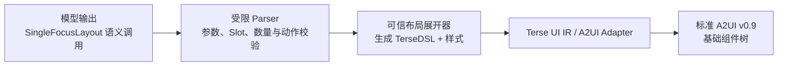

# Widget Service 布局高级组件 Wiki

> 当前范围：第一个布局高级组件 `SingleFocusLayout`。
>
> 表达约定：本文统一使用 **TerseDSL**。高级组件是生成期语义宏，由可信服务端确定性展开为
> “基础组件 + 内联样式对象”的 TerseDSL，再转换为标准 A2UI v0.9；端侧 Catalog 不新增
> `SingleFocusLayout` 节点。
>
> 业务内容组件的字段、变体和内部样式见
> [`advanced-business-components-wiki.md`](advanced-business-components-wiki.md)。

## 1. 设计目标

布局高级组件用于封装稳定的卡片几何关系，让模型表达“单焦点、主辅、同级、列表、动作矩阵”等
布局意图，而不是直接编写任意宽高、间距和定位。

整体链路如下：



边界规则：

- 模型只选择注册过的布局、业务内容和动作，不直接控制任意样式。
- 布局高级组件只负责区域、方向、对齐、间距、裁剪和动作预留区，不读取业务数据。
- 业务高级组件负责字段、文字层级、业务状态和内部微排版。
- 内联样式对象只由可信展开器生成；高级组件名不得进入最终 A2UI。
- 样式直接写在 TerseDSL 组件的末尾 options 对象中，不额外嵌套 `styles` 对象。

## 2. `SingleFocusLayout`

### 2.1 一句话定义

`SingleFocusLayout` 用整张卡片的单一业务区域表达一个主要对象，并可附带一个主动作。

“单一对象”按用户任务判断，不按基础组件数量判断。一个日程详情可以包含标题、时间和地点；一个
健康指标可以包含数值、单位和进度；它们仍分别属于一个主对象。

### 2.2 适用场景

| 场景类型 | 典型内容 | 推荐对齐 | 动作形态 |
| --- | --- | --- | --- |
| 大数值/状态 | 电量、使用时长、睡眠时长、倒计时 | `bottomStart` 或 `centerStart` | 无动作或右下 `IconAction` |
| 单条详情 | 下一日程、未接来电、备忘录 | `topStart` | 底部 `PillAction` |
| 单一进度 | 目标完成度、资源占用、运动进度 | `bottomStart` | 无动作或底部 `PillAction` |
| 单一列表对象 | 同一备忘录的条目、同一日程的子项 | `topStart` | 通常无动作 |
| 单一图片内容 | 产品图、封面或状态插图及简短说明 | `bottomStart` | 右下 `IconAction` |

列表仍必须围绕同一主题。2×2 最多 2 项，2×4 最多 3 项；超过预算时优先减少低优先级条目，
不通过缩小主信息来容纳更多内容。

### 2.3 不适用场景

以下场景不应使用 `SingleFocusLayout`：

- 两个独立且同等重要的对象：使用 `PeerPairLayout` 或 `EqualItemsLayout`。
- 一个主对象加一个独立辅助对象：使用 `HeroSupportLayout`。
- 主对象、辅助对象和动作同时存在：使用 `HeroSupportActionLayout`。
- 用户任务以动作选择为核心，包含 2～4 个操作：使用 `ActionMatrixLayout`。
- 当前天气加未来预报：使用 `WeatherNowForecastLayout`。
- 仅因为数据同时可用就把多个业务模块塞进同一区域。

### 2.4 与 `HeroActionLayout` 的边界

两者都能呈现“一个业务对象 + 一个动作”，但语义优先级不同：

| 判断条件 | 选择 |
| --- | --- |
| 动作是任务完成的必要入口，例如“加入会议”“立即回拨” | `HeroActionLayout` |
| 内容本身是核心，动作只是可选快捷入口 | `SingleFocusLayout` |
| 没有已批准动作 | `SingleFocusLayout` |

这样可以避免同一场景同时暴露两个没有明确差异的布局候选。

## 3. 对外语义契约

### 3.1 调用形式

```text
SingleFocusLayout([config], businessChild[, actionChild]);
```

示例：

```typescript
SingleFocusLayout(
  { "contentAlign": "topStart" },
  Column(
    "compact",
    Text("UI 需求评审会", "title"),
    Text("14:00 - 15:30", "body"),
    Text("深圳园区", "subtitle")
  ),
  PillAction({ "actionId": "event.joinMeeting" })
);
```

`SingleFocusLayout`、`PillAction` 和 `IconAction` 是生成期语义节点；示例中的 `Column`、`Text`
是允许与业务高级组件混排的基础 TerseDSL 节点。

### 3.2 参数

| 参数 | 类型 | 默认值 | 说明 |
| --- | --- | --- | --- |
| `contentAlign` | `topStart \| centerStart \| bottomStart` | `topStart` | 主业务区域在可用空间内的纵向对齐；水平方向固定为 Start |

参数对象是闭合对象，不允许额外字段。布局调用只能有一个业务 child；业务 child 内部可以是一个
业务高级组件展开结果，也可以是一个完整的基础组件子树。

### 3.3 Slot 与数量

| Slot | 2×2 | 2×4 | 约束 |
| --- | ---: | ---: | --- |
| `businessChild` | 1 | 1 | 必填；不得再包含布局高级组件 |
| `actionChild` | 0～1 | 0～1 | 可选；必须是根的最后一个直接 child |

允许的动作：

- `PillAction`：底部整行主动作。
- `IconAction`：右下角紧凑快捷动作。

`ActionTile` 不属于 `SingleFocusLayout`；它用于 2×4 多操作区域。

## 4. UX 规范

### 4.1 通用几何

| Token | 值 | 用途 |
| --- | ---: | --- |
| `radius` | `20vp` | 卡片根圆角 |
| `safeInset` | `12vp` | 卡片四周安全边距 |
| `sectionGap` | `8vp` | 内容区与动作区间距 |
| `denseInnerGap` | `4vp` | 同一业务对象内部的紧密间距 |
| `pillActionHeight` | `36vp` | 胶囊动作高度 |
| `iconActionSize` | `30vp` | 圆形图标动作可见尺寸 |
| `iconActionIconSize` | `16vp` | 圆形动作内部图标尺寸 |

卡片逻辑画布由转换器锁定为 2×2 `160×160vp`、2×4 `320×160vp`。根节点始终铺满宿主卡片，
开启裁剪，任何文字、图片、进度和动作都不得越过 `12vp` 安全区。

### 4.2 无动作

- `topStart`：适合详情文本、备忘录和短列表，阅读顺序从左上开始。
- `centerStart`：适合视觉中心明确且内容很少的图标、状态或单一数值。
- `bottomStart`：适合大数值、进度和图片说明，让主信息形成稳定的下沿。
- 对齐只改变整个业务子树在可用区域中的位置，不改变业务子树内部的文字层级和排列。

### 4.3 底部胶囊动作

- `PillAction` 固定在底部，高 `36vp`，与业务区域保持 `8vp` 间距。
- 业务区域占用剩余高度并允许收缩；不得被按钮覆盖。
- 按钮宽度填满当前布局区域，文字保持单行，推荐约 4 个汉字，最多 6 个汉字。
- 空间不足时先减少正文和低优先级辅助信息，再调整字号；主信息不得优先缩小。

### 4.4 右下图标动作

- `IconAction` 可见容器为 `30×30vp`，图标为 `16×16vp`。
- 布局在内容右侧和底部各预留 `38vp`，即 `30vp` 动作尺寸加 `8vp` 间距。
- 动作层固定右下对齐，内容层固定左上对齐，二者通过 `Stack` 分层。
- 内容不得进入预留区；图标必须来自已批准的本地素材，并与动作语义一致。

### 4.5 文字、信息与溢出

- 普通标题默认 14fp，必要时降到 12fp；保持单行并省略。
- 正文默认 14fp；2×2 最多 3～4 行，2×4 按业务区域预算控制。
- 辅助信息使用 10fp，不能再降低。
- 同一主对象内部最多形成 2 层信息层级（2×2）或 3 层信息层级（2×4）。
- 业务区和根卡片都必须裁剪；超出空间预算时不允许滚动，也不允许突破卡片边界。

## 5. 可信 TerseDSL + 样式展开

以下代码是服务端可信展开结果，不是允许模型自由生成的样式接口。`CONTENT` 和 `ACTION` 仅在本节
表示已经解析并校验通过的 AST 子树。

### 5.1 无动作

```text
Column("compact", {
  "width": "100%",
  "height": "100%",
  "itemMargin": 4,
  "justifyContent": ALIGN,
  "alignItems": "start",
  "clip": true
}, CONTENT)
```

`ALIGN` 的确定性映射：

| `contentAlign` | `justifyContent` |
| --- | --- |
| `topStart` | `start` |
| `centerStart` | `center` |
| `bottomStart` | `end` |

### 5.2 底部 `PillAction`

```text
Column("section", {
  "width": "100%",
  "height": "100%",
  "itemMargin": 8,
  "justifyContent": "spaceBetween"
},
  Column("compact", {
    "layoutWeight": 1,
    "itemMargin": 4,
    "justifyContent": ALIGN,
    "alignItems": "start",
    "clip": true,
    "constraintSize": { "minWidth": 0, "minHeight": 0 }
  }, CONTENT),
  Stack("overlay", {
    "width": "100%",
    "height": 36,
    "padding": 8,
    "borderRadius": 18,
    "alignContent": "center",
    "onClick": APPROVED_EVENT
  }, ACTION_CONTENT)
)
```

### 5.3 右下 `IconAction`

```text
Stack("overlay", { "width": "100%", "height": "100%" },
  Stack("overlay", {
    "width": "100%",
    "height": "100%",
    "alignContent": "topStart"
  },
    Column("compact", {
      "width": "100%",
      "height": "100%",
      "padding": { "right": 38, "bottom": 38 },
      "itemMargin": 4,
      "justifyContent": ALIGN,
      "alignItems": "start",
      "clip": true
    }, CONTENT)
  ),
  Stack("overlay", {
    "width": "100%",
    "height": "100%",
    "alignContent": "bottomEnd"
  },
    Stack("overlay", {
      "width": 30,
      "height": 30,
      "borderRadius": 15,
      "alignContent": "center",
      "onClick": APPROVED_EVENT
    },
      Image(APPROVED_ICON, "icon", {
        "width": 16,
        "height": 16,
        "objectFit": "contain"
      })
    )
  )
)
```

### 5.4 卡片根包装

高级组件展开完成后，服务端统一增加卡片根。宽高由卡片尺寸锁定，不由高级组件手写：

```text
Column("card", {
  "padding": 12,
  "borderRadius": 20,
  "itemMargin": 8,
  "clip": true,
  "backgroundColor": THEME_BACKGROUND
}, LOWERED_SINGLE_FOCUS_CONTENT);
```

## 6. 完整示例

### 6.1 2×2 下一日程 + 打开日历

模型语义输出：

```typescript
SingleFocusLayout(
  { "contentAlign": "topStart" },
  Column(
    "compact",
    Text("UI 需求评审会", "title"),
    Text("14:00 - 15:30", "body"),
    Text("深圳园区", "subtitle")
  ),
  PillAction({ "actionId": "event.openCalendar" })
);
```

可信展开后的 TerseDSL 结构：

```typescript
Column("card", {
  "padding": 12,
  "borderRadius": 20,
  "itemMargin": 8,
  "clip": true,
  "backgroundColor": "background_primary"
},
  Column("section", {
    "width": "100%",
    "height": "100%",
    "itemMargin": 8,
    "justifyContent": "spaceBetween"
  },
    Column("compact", {
      "layoutWeight": 1,
      "itemMargin": 4,
      "justifyContent": "start",
      "alignItems": "start",
      "clip": true,
      "constraintSize": { "minWidth": 0, "minHeight": 0 }
    },
      Text("UI 需求评审会", "title", {
        "maxLines": 1,
        "textOverflow": "ellipsis"
      }),
      Text("14:00 - 15:30", "body"),
      Text("深圳园区", "subtitle", {
        "maxLines": 1,
        "textOverflow": "ellipsis"
      })
    ),
    Stack("overlay", {
      "width": "100%",
      "height": 36,
      "padding": 8,
      "borderRadius": 18,
      "backgroundColor": "comp_background_tertiary",
      "alignContent": "center",
      "onClick": [{
        "call": "clickToApi",
        "args": { "eventName": "event.openCalendar" }
      }]
    },
      Row("actions", { "justifyContent": "center", "itemMargin": 8 },
        Text("打开日历", "body", {
          "fontSize": 14,
          "fontWeight": 500,
          "maxLines": 1
        })
      )
    )
  )
);
```

### 6.2 2×2 单一状态 + 右下快捷动作

```typescript
SingleFocusLayout(
  { "contentAlign": "bottomStart" },
  Column(
    "compact",
    Text("剩余电量", "subtitle"),
    Row(
      Text("18", "title"),
      Text("%", "body")
    ),
    Text("预计可用 2 小时", "body")
  ),
  IconAction({
    "actionId": "event.enablePowerSaving",
    "icon": "resources/base/media/power_saving.svg"
  })
);
```

展开器必须为右下动作预留 `38×38vp`，并把事件和素材替换为服务端已批准的绑定；模型不能直接
写 `onClick`、网络地址、资源外路径或任意事件参数。

### 6.3 2×4 单一进度

```typescript
SingleFocusLayout(
  { "contentAlign": "bottomStart" },
  Column(
    "compact",
    Text("本周运动目标", "title"),
    Row("between",
      Text("4 / 7 天", "body"),
      Text("57%", "subtitle")
    ),
    Progress({ "value": 4, "total": 7 })
  )
);
```

## 7. 展开与校验规则

服务端在展开前必须完成以下检查：

1. 根节点是当前 Scope 允许的 `SingleFocusLayout`。
2. 配置对象只包含合法的 `contentAlign`。
3. 恰好有一个业务 child，且其中不嵌套其它布局高级组件。
4. 动作数量为 0 或 1；存在时必须是最后一个直接 child。
5. 动作只能是 `PillAction` 或 `IconAction`，动作 ID 与素材均来自当前 TaskSpec 白名单。
6. 模型输出中不得出现 `onClick`、任意样式覆盖、绝对坐标或未注册组件。
7. 展开后的 TerseDSL 必须满足组件数、嵌套深度和垂直空间预算。
8. 最终 A2UI 不得残留 `SingleFocusLayout`、`PillAction`、`IconAction` 或内部 Slot 名。

## 8. 验收清单

- [ ] 2×2、2×4 均只表达一个主要业务对象。
- [ ] `contentAlign` 在三种取值下都有确定性展开结果。
- [ ] 无动作、底部胶囊动作、右下图标动作三种状态均有 Golden 示例。
- [ ] 胶囊动作与内容之间始终有 `8vp` 间距。
- [ ] 图标动作存在时，内容区始终预留 `38×38vp`。
- [ ] 2×2 列表不超过 2 项，2×4 列表不超过 3 项。
- [ ] 超长标题、正文和辅助信息按层级截断，不越过卡片安全区。
- [ ] 动作事件、图标素材和可见文案全部来自可信契约。
- [ ] 展开结果只包含标准基础组件和可映射样式。
- [ ] 最终 A2UI wire version 为 `v0.9`，且无高级组件名泄漏。

## 9. 布局组件总览

| 布局组件 | 核心语义 | 业务 children | Action | 典型场景 |
| --- | --- | --- | --- | --- |
| `SingleFocusLayout` | 一个主要对象 | 1 | 0～1 | 大数值、单条详情、单一进度 |
| `HeroActionLayout` | 一个主要对象和必要动作 | 1 | 1 | 入会、回拨、省电、开始训练 |
| `HeroSupportLayout` | 主对象和解释对象 | 2 | 0 | 天气+日程、活动+睡眠 |
| `HeroSupportActionLayout` | 主对象、解释对象和必要动作 | 2 | 1 | 天气+会议+打车、电量+建议+省电 |
| `PeerPairLayout` | 两个同权对象 | 2 | 0～1 | 左右耳电量、两个位置、两个同类指标 |
| `SequentialSummaryLayout` | 先总览、后分解 | 2～3 / 2～4 | 0 | 总进度+分项、总状态+部件状态 |
| `EqualItemsLayout` | 多个同权对象 | 2 / 2～4 | 0 | 预报项、设备项、排行项 |
| `ListActionLayout` | 一个列表对象和整体动作 | 1 | 0～1 | 待办、通话记录、日程列表 |
| `ActionMatrixLayout` | 可选摘要和多个同级动作 | 0～1 | 2 / 2～4 | 系统模式、快捷设置、媒体控制 |
| `WeatherNowForecastLayout` | 当前天气和未来天气 | 1 / 1～4 | 0～1 | 当前天气、未来三项预报、天气快捷动作 |

表格中使用“2×2 / 2×4”表示两个尺寸分别允许的数量。所有 Action 都必须是布局根连续的末尾
直接 children；业务 children 的内部组件数不计入布局 Slot 数量。

## 10. `HeroActionLayout`

### 10.1 使用场景与边界

用于一个主状态、指标或对象加一个完成当前任务所必需的动作，例如加入会议、回拨、省电、开始训练
或立即管控。动作不是必要入口时应回到 `SingleFocusLayout`；还需要独立解释对象时改用
`HeroSupportActionLayout`。

```text
HeroActionLayout([config], heroChild, actionChild);
```

| 配置 | 取值 | 默认 | 约束 |
| --- | --- | --- | --- |
| `actionPlacement` | `bottom \| end` | `bottom` | `end` 仅支持 2×4 |

业务 child 固定 1 个，Action 固定 1 个且必须位于最后。2×2 优先 `PillAction`；只有动作语义可由
图标准确表达时使用右下 `IconAction`。2×4 可使用底部动作或右侧动作区。

### 10.2 UX 规范

- 2×2 `bottom`：Hero 使用剩余高度，底部动作高 `36vp`，两区间距 `8vp`。
- 2×2 图标动作：复用 `SingleFocusLayout` 的 `38×38vp` 右下预留区。
- 2×4 `end`：Hero 与动作区按 `60:40` 分配，横向间距 `8vp`；动作在右区靠下。
- 2×4 `bottom`：Hero 单区铺开，动作位于所属区域底部。
- Hero 必须保持唯一视觉焦点；动作区不得承载第二个业务组件。

### 10.3 可信 TerseDSL + 样式展开

`bottom` 使用以下骨架：

```text
Column("section", {
  "width": "100%", "height": "100%",
  "itemMargin": 8, "justifyContent": "spaceBetween"
},
  Column("compact", {
    "layoutWeight": 1, "justifyContent": "start",
    "alignItems": "start", "clip": true,
    "constraintSize": { "minWidth": 0, "minHeight": 0 }
  }, HERO),
  ACTION
)
```

2×4 `end` 使用两个可收缩的等高区域：

```text
Row("between", { "width": "100%", "height": "100%", "itemMargin": 8 },
  Column("compact", { "layoutWeight": 60, "clip": true }, HERO),
  Column("compact", {
    "layoutWeight": 40, "justifyContent": "end",
    "alignItems": "start", "clip": true
  }, ACTION)
)
```

## 11. `HeroSupportLayout`

### 11.1 使用场景与契约

用于一个主对象和一个支持对象，二者存在明确主次但没有显式主动作。典型组合包括天气+日程、日期+
待办、设备电量+耳机状态、活动+睡眠和位置+天气。

```text
HeroSupportLayout([config], heroChild, supportChild);
```

| 配置 | 取值 | 默认 |
| --- | --- | --- |
| `ratio` | `balanced \| heroWide \| supportWide` | 2×2 `heroWide`；2×4 `balanced` |
| `direction` | `auto \| horizontal \| vertical` | `auto` |

业务 children 固定 2 个，不接受 Action。`auto` 在 2×4 固定使用横向；2×2 遇到 Image、Progress
等视觉区域时优先横向，纯文本区域优先纵向。

### 11.2 UX 规范

- `balanced` 为 `50:50`，`heroWide` 为 `56:44`，`supportWide` 为 `44:56`。
- 2×2 必须通过字号、面积或位置体现主次，不能把两个区域都渲染成 Hero。
- 2×4 默认左右布局，区域间距 `8vp`。
- 2×4 纯文本 Support 使用中性半透明底托、`8vp` 圆角，横向 `12vp`、纵向 `8vp` 内边距。
- Support 是图片或 Ring 时可不增加底托，但必须在自己的区域内居中并裁剪。

### 11.3 可信 TerseDSL + 样式展开

横向模式：

```text
Row("between", {
  "width": "100%", "height": "100%",
  "itemMargin": 8, "alignItems": "center"
},
  Column("compact", {
    "layoutWeight": HERO_WEIGHT, "clip": true,
    "constraintSize": { "minWidth": 0, "minHeight": 0 }
  }, HERO),
  Column("compact", {
    "layoutWeight": SUPPORT_WEIGHT, "clip": true,
    "constraintSize": { "minWidth": 0, "minHeight": 0 }
  }, SUPPORT_PANEL)
)
```

纵向模式把根替换为 `Column("section", ...)`，两个区域分别使用相同权重与纵向可收缩约束。

## 12. `HeroSupportActionLayout`

### 12.1 使用场景与契约

用于一个主对象、一个解释或上下文对象以及一个必要动作，是信息与行动并重的结构。

```text
HeroSupportActionLayout([config], heroChild, supportChild, actionChild);
```

| 配置 | 取值 | 默认 |
| --- | --- | --- |
| `heroRatio` | `wide \| balanced` | `wide` |

业务 children 固定 2 个，Action 固定 1 个。2×2 Support 只能是 1～2 行紧凑信息；2×4 支持
`PillAction`、`IconAction` 或单个 `ActionTile`，但同一卡片仍只有一个主动作。

### 12.2 UX 规范

- 2×2 顺序固定为 Hero → Support → Action，区间距均为 `8vp`。
- 2×2 Support 高度上限 `36vp`；空间不足时删除非必需 Support，不压缩或遮挡 Action。
- 2×4 默认左右 `56:44`；`balanced` 为 `50:50`。
- 2×4 左侧是 Hero；右侧纵向放 Support 和 Action，右上/右下间距 `8vp`。
- 纯文本 Support 使用中性底托；动作色可以表达语义，但不能改变整卡主色家族。

### 12.3 可信 TerseDSL + 样式展开

2×4：

```text
Row("between", { "width": "100%", "height": "100%", "itemMargin": 8 },
  Column("compact", { "layoutWeight": HERO_WEIGHT, "clip": true }, HERO),
  Column("section", {
    "layoutWeight": SUPPORT_WEIGHT, "height": "100%",
    "itemMargin": 8, "justifyContent": "spaceBetween", "clip": true
  },
    Stack("overlay", {
      "layoutWeight": 1, "padding": { "left": 12, "top": 8, "right": 12, "bottom": 8 },
      "borderRadius": 8, "clip": true
    }, SUPPORT),
    ACTION
  )
)
```

2×2 使用纵向 `Column("section")`，Hero 获得剩余权重，Support 固定不超过 `36vp`，Action 固定
在底部。

## 13. `PeerPairLayout`

### 13.1 使用场景与契约

用于两个同权、可独立阅读且结构相近的对象，例如左右耳电量、两个联系人、两个位置或两个同类健康
指标。对象存在先后或解释关系时应使用 `SequentialSummaryLayout`。

```text
PeerPairLayout([config], firstChild, secondChild[, actionChild]);
```

| 配置 | 取值 | 默认 |
| --- | --- | --- |
| `orientation` | `auto \| rows \| columns` | `auto` |

业务 children 固定 2 个，Action 为 0～1 个。`auto` 在 2×4 使用左右列；2×2 纯文本优先上下行，
包含图片、Ring 或 Progress 时优先左右列。有 Action 的 2×2 强制把两个对象放在上方左右列。

### 13.2 UX 规范

- 两个区域权重固定 `50:50`，区域间距 `8vp`。
- 同级对象必须使用一致的字号、图标尺寸、Ring 尺寸和内部结构。
- 2×2 `rows` 每行可采用“图标/图片 + 文本”；`columns` 采用图标在上、文字在下。
- 可选动作属于两个对象的整体任务，不能只作用于其中一项而造成语义歧义。

### 13.3 可信 TerseDSL + 样式展开

```text
Row("between", { "width": "100%", "height": "100%", "itemMargin": 8 },
  Column("compact", { "layoutWeight": 50, "clip": true }, FIRST),
  Column("compact", { "layoutWeight": 50, "clip": true }, SECOND)
)
```

`rows` 将根替换为 `Column("section")`。存在 Action 时，再使用与 `SingleFocusLayout` 相同的底部
动作或右下图标动作包装。

## 14. `SequentialSummaryLayout`

### 14.1 使用场景与契约

用于“先看总览，再看解释或分解”的有序结构，例如主进度+分类、总使用量+分项、总体设备状态+
部件状态。

```text
SequentialSummaryLayout([config], primaryChild, detailChild1[, detailChild2 ...]);
```

| 配置 | 类型 | 默认 | 限制 |
| --- | --- | --- | --- |
| `detailColumns` | `1..4` | Detail 数量 | 2×2 最多 2 列，2×4 最多 4 列 |

2×2 业务 children 为 2～3 个，2×4 为 2～4 个；第一个固定是 Primary，其余均为 Detail。不接受
Action。

### 14.2 UX 规范

- Primary 占上部并保持唯一主视觉；Detail 位于下部。
- Primary 与 Detail 区间距 `8vp`，Detail 之间也使用 `8vp`。
- Detail 使用一致的中性底托、`8vp` 圆角和相同结构。
- 2×2 Detail 最多 2 个；2×4 最多 3 个 Detail，可按 1～4 列组织。
- Detail 不得重复 Primary 已展示的同一事实。

### 14.3 可信 TerseDSL + 样式展开

```text
Column("section", { "width": "100%", "height": "100%", "itemMargin": 8 },
  Column("compact", { "layoutWeight": 1, "clip": true }, PRIMARY),
  Row("between", { "layoutWeight": 1, "itemMargin": 8, "clip": true },
    Stack("overlay", { "layoutWeight": 1, "padding": 8, "borderRadius": 8 }, DETAIL_1),
    Stack("overlay", { "layoutWeight": 1, "padding": 8, "borderRadius": 8 }, DETAIL_2)
  )
)
```

Detail 超过列数时由可信展开器生成多行等权网格；模型不手写行列循环。

## 15. `EqualItemsLayout`

### 15.1 使用场景与契约

用于多个没有天然主次、结构完全一致的对象，例如未来天气、设备电量、App 排行或近期事件。

```text
EqualItemsLayout([config], item1, item2[, item3, item4]);
```

| 配置 | 取值 | 默认 |
| --- | --- | --- |
| `arrangement` | `auto \| row \| grid` | `auto` |

2×2 只允许 2 个 item；2×4 允许 2～4 个。`auto` 对 2～3 项使用单行，对 4 项使用 `2×2`
网格。不接受 Action。

### 15.2 UX 规范

- 所有 item 等权、同高并使用完全一致的字体、图标、圆角和内部对齐。
- 每个 item 使用 `8vp` 内边距、`8vp` 圆角；区域间距 `8vp`。
- 2×4 三项使用三列等宽；四项默认 `2×2`，只有内容足够短时才可四列。
- 图片必须完整显示且等分；大数值和控制摘要在单元中心对齐。

### 15.3 可信 TerseDSL + 样式展开

```text
Row("between", { "width": "100%", "height": "100%", "itemMargin": 8 },
  Stack("overlay", {
    "layoutWeight": 1, "padding": 8,
    "borderRadius": 8, "alignContent": "center", "clip": true
  }, ITEM_1),
  Stack("overlay", {
    "layoutWeight": 1, "padding": 8,
    "borderRadius": 8, "alignContent": "center", "clip": true
  }, ITEM_2)
)
```

`grid` 由纵向 `Column("section")` 包装两个等权 `Row`，各行最多 2 项。

## 16. `ListActionLayout`

### 16.1 使用场景与契约

用于一个短列表对象和一个针对整组列表的可选动作，例如查看全部待办、打开通话记录、打开日历或
进入设置列表。

```text
ListActionLayout([config], listChild[, actionChild]);
```

| 配置 | 取值 | 默认 | 约束 |
| --- | --- | --- | --- |
| `actionPlacement` | `bottom \| end` | `bottom` | `end` 仅支持 2×4 |

业务 child 固定 1 个，其内部必须是同一业务主题的 List；Action 为 0～1 个。

### 16.2 UX 规范

- 2×2 最多 2 项；有底部动作且空间不足时降为 1 项。
- 2×4 最多 3 项；动作可位于底部或右侧独立区。
- 列表项主文字 12fp，辅助信息 10fp，均单行省略。
- 同组列表项使用一致的底托、圆角、图标和文字位置。
- Action 作用于整组列表；单项动作应留在业务详情页，不在卡片上重复。

### 16.3 可信 TerseDSL + 样式展开

`bottom` 复用底部动作骨架，List 作为可收缩主区：

```text
Column("section", {
  "width": "100%", "height": "100%",
  "itemMargin": 8, "justifyContent": "spaceBetween"
},
  Column("compact", { "layoutWeight": 1, "clip": true }, LIST),
  ACTION
)
```

2×4 `end` 使用 `60:40` 横向区域，右侧 Action 靠下，规则与 `HeroActionLayout` 一致。

## 17. `ActionMatrixLayout`

### 17.1 使用场景与契约

用于可选业务摘要和 2～4 个同级控制项，主要覆盖系统模式、快捷设置、智能设备和媒体控制。

```text
ActionMatrixLayout([config], [summaryChild], action1, action2[, action3, action4]);
```

| 配置 | 类型 | 默认 | 约束 |
| --- | --- | --- | --- |
| `primaryActionIndex` | `0..3` | `0` | 必须小于实际 Action 数量 |

2×2 可有 0～1 个摘要和恰好 2 个 Action；2×4 可有 0～1 个摘要和 2～4 个 Action。Action 必须
全部使用 `ActionTile`，并具有不同的动作 ID。

### 17.2 UX 规范

- 2×2 两个控制项同宽、同高，不再叠加全宽 CTA。
- 2×4 两项并排；三项为一个主项加两个次项；四项为 `2×2` 网格。
- 同级动作统一使用 12fp 文字、16vp 图标、`8vp` 圆角和 `8vp` 间距。
- 主动作只能通过面积或色彩适度增强，不能切换到另一套字体和图标体系。
- 摘要只说明当前模式或设备状态，不能成为第二个操作区。

### 17.3 可信 TerseDSL + 样式展开

四项矩阵：

```text
Column("section", { "width": "100%", "height": "100%", "itemMargin": 8 },
  Row("between", { "layoutWeight": 1, "itemMargin": 8 }, ACTION_1, ACTION_2),
  Row("between", { "layoutWeight": 1, "itemMargin": 8 }, ACTION_3, ACTION_4)
)
```

三项把主动作放在第一行，两个次动作放在第二行。存在摘要时，2×2 使用上下各一半，2×4 使用
摘要 `56%`、矩阵 `44%` 的横向结构。

## 18. `WeatherNowForecastLayout`

### 18.1 使用场景与契约

用于当前天气与真实未来预报的专用结构。没有 forecast 数据时只能展示当前天气，不能根据当前状态
推测未来天气。

```text
WeatherNowForecastLayout(currentChild[, forecast1, forecast2, forecast3][, actionChild]);
```

该布局没有配置对象。2×2 业务 child 固定 1 个；2×4 允许 1～4 个，其中第一个固定为 current，
其余最多 3 个 forecast。Action 为 0～1 个。

### 18.2 UX 规范

- 2×2 只显示当前天气，不展示未来列表；城市、主温度、天气/空气和高低温组成一个原子内容组件。
- 2×2 主天气图标 48/56vp、温度 38fp；可在右下使用一个天气语义 `IconAction`。
- 2×4 当前天气为唯一 Hero，未来预报最多 3 项且结构完全一致。
- 2×4 当前天气与预报区按纵向 `3:2` 分配，区间距 `8vp`。
- 预报项使用中性底托；风险色只作用于预警文字或图标，不把整卡根面改为告警色。
- 当前天气、预报项和支持信息之间不得重复展示相同事实。

### 18.3 可信 TerseDSL + 样式展开

2×4：

```text
Column("section", { "width": "100%", "height": "100%", "itemMargin": 8 },
  Column("compact", { "layoutWeight": 3, "clip": true }, CURRENT),
  Row("between", { "layoutWeight": 2, "itemMargin": 8, "clip": true },
    Stack("overlay", { "layoutWeight": 1, "padding": 8, "borderRadius": 8 }, FORECAST_1),
    Stack("overlay", { "layoutWeight": 1, "padding": 8, "borderRadius": 8 }, FORECAST_2),
    Stack("overlay", { "layoutWeight": 1, "padding": 8, "borderRadius": 8 }, FORECAST_3)
  )
)
```

2×2 退化为单区当前天气；存在动作时复用右下 `IconAction` 预留规则。2×4 若存在动作，则可信端
根据动作类型在不破坏当前天气和预报权重的前提下增加底部或右下动作层。

## 19. 布局选择规则

布局选择按用户任务语义进行，而不是按可用数据数量机械组合：

1. 先确认业务对象数量和主次关系。
2. 再确认动作数量、动作是否是任务完成的必要入口。
3. 有先后关系选择 `SequentialSummaryLayout`，同权关系选择 `PeerPairLayout` 或
   `EqualItemsLayout`。
4. 列表是一个业务对象，不因列表包含多行就选择多对象布局。
5. 天气“当前+预报”优先进入天气专用布局。
6. 2×2 无法同时容纳 Hero、Support 和 Action 时，删除非必需 Support；不得压缩主信息和动作。
7. 任何布局都不能为了填满空间生成不存在的事实、动作或素材。

## 20. 全布局验收清单

- [ ] 10 个布局都有闭合配置 Schema、2×2/2×4 child 预算和 Action 预算。
- [ ] 每个布局根只接收直接 Slot children，禁止嵌套另一个布局高级组件。
- [ ] 所有样式只由可信展开器写入 TerseDSL options 对象。
- [ ] 纵横重排、区域权重、间距、圆角、内边距和裁剪均为确定性结果。
- [ ] `ActionMatrixLayout` 之外每张卡片最多一个主动作。
- [ ] 布局 Action 始终位于连续末尾 children，并绑定已批准事件。
- [ ] 2×2 列表最多 2 项，2×4 列表和预报最多 3 项。
- [ ] 展开结果不包含绝对坐标、网络素材或动态执行表达式。
- [ ] 最终 A2UI 只包含标准基础组件，不残留任何布局或 Action 高级组件名。
