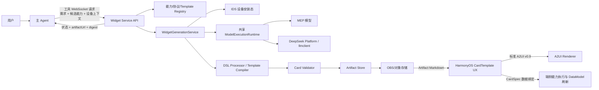
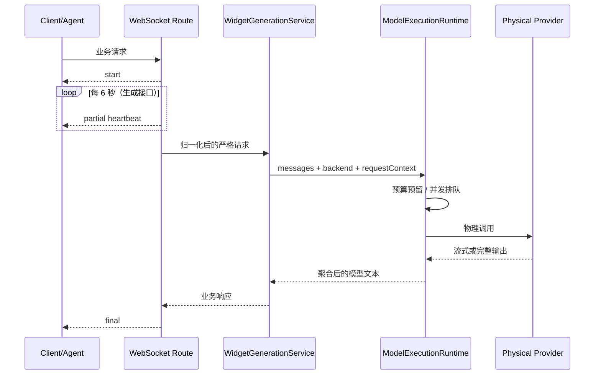
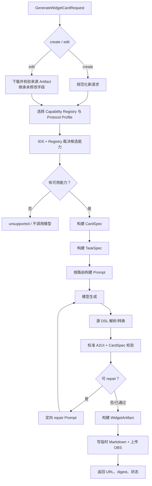
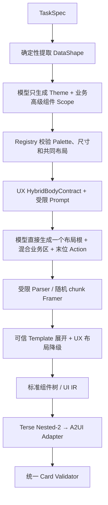

# Widget Service 代码结构、架构上下文与输入输出 Wiki

> 文档范围：`CreateMyCard/widget_service` 当前 Python 正式服务。
>
> 本文以代码为准，描述服务边界、目录职责、生成链路、各层输入输出、模板融合机制、验证与持久化。方案背景和协议决策仍以仓库根目录的 `docs/云侧方案设计.md` 为权威文档。
>
> Nested-2 批量用例的端到端故障、修复和真机验收记录见 [Nested-2 卡片批跑端到端修复 Wiki](nested2-batch-e2e-fix-wiki.md)。

## 1. 一句话定位

Widget Service 是位于主 Agent 与 HarmonyOS 卡片端侧之间的生成微服务。它接收主 Agent 给出的用户需求和候选能力，完成能力裁决、模型输入构建、UI 生成、可信端协议转换、质量校验和 Artifact 持久化，最终只向端侧交付标准 A2UI v0.9 与运行时 CardSpec。

服务不负责：

- 主 Agent 的对话 SOP、候选能力召回和最终自然语言回复；
- 端侧卡片的下载、渲染、持久化和数据刷新调度；
- 让模型直接决定未授权的数据能力、事件或素材；
- 把内部 `Template` 节点传给端侧 Renderer。

## 2. 系统架构上下文



### 2.1 上游

| 上游 | 交给服务的内容 | 服务是否信任 |
| --- | --- | --- |
| 主 Agent | `userQuery`、标题、描述、尺寸、候选数据绑定、候选事件、候选素材 | 仅视为候选；必须由服务端 Registry 和设备态重新裁决 |
| 设备请求包络 | ROM、产品版本、locale、会话/交互 ID、设备标识 | 用于选 Registry、协议 Profile 和模型追踪；日志按环境脱敏 |
| IDS | 受约束包名的安装态 | 只影响声明了相关依赖的能力可用性 |
| 来源 Artifact | 编辑模式的上一版卡片 | 必须通过大小、编码、schema 和结构校验，并重新计算 digest 用于追踪 |

### 2.2 下游

| 下游 | 服务输出 | 边界 |
| --- | --- | --- |
| 主 Agent | `status`、`artifactUrl`、`artifactDigest`、降级/移除能力摘要 | 不内联完整 Artifact |
| CardTemplate UX | 从 Artifact 下载 `genui`、`cardspec` 等代码块 | `genui` 必须是标准 A2UI；端侧无需理解 Template |
| A2UI Renderer | 三条标准 A2UI JSONL 消息 | wire version 固定为 `v0.9`，Catalog 为 `ohos.a2ui.extended.catalog` |
| 数据运行时 | CardSpec 中的已裁决 `dataBindings` | 后续刷新只写入 A2UI DataModel，不重新生成 UI |

## 3. 代码目录地图

```text
widget_service/
├── cloud/
│   ├── api/                         # WebSocket 路由、外部包络归一化、流式响应
│   ├── app/                         # 日志上下文、日志脱敏、WS 指标和旧基础模型
│   ├── config/                      # WIDGET_SERVICE_* 配置及路径解析
│   ├── core/                        # JSON Pointer 与内部通用错误
│   ├── custom/                      # 模型客户端、传输层、并发、超时、预算
│   ├── data/
│   │   ├── capabilities/            # 按 App/ROM 版本选择的能力 Registry
│   │   ├── protocol_profiles/       # 标准/Compact/Terse 协议和 Prompt Profile
│   │   ├── cardplan_template/       # Template、Theme、高级组件 Registry 源数据
│   │   ├── validator_rules/         # A2UI/CardSpec 校验规则快照
│   │   └── mock/                    # 本地 IDS/模型测试数据
│   ├── errors/                      # 对外稳定错误码与状态映射
│   ├── models/                      # CardSpec、TaskSpec、Capability、Artifact 模型
│   ├── services/
│   │   ├── advanced_component_pipeline/ # 新 Scope/UX 混合入口及保留的旧整卡入口
│   │   ├── cardplan_template/       # Hybrid Contract、Parser、Framer、Registry、Compiler
│   │   ├── card_validation/         # 协议、组件、绑定、事件、素材、跨对象校验
│   │   └── ...                      # 能力解析、Prompt、转换、重试、Artifact
│   ├── utils/                       # 下载、上传、临时文件工具
│   ├── workspace/                   # 运行时数据；不进入源码包
│   └── start_websocket_server.py    # FastAPI 应用入口与生命周期
├── docs/                            # 运行、设计、映射和本文 Wiki
├── scripts/                         # Bundle/Prompt 生成、Golden 评估与报告工具
├── tests/                           # 单元、协议、路由、安全、Golden 回归测试
├── Dockerfile                       # 非 root 生产镜像与健康检查
├── pyproject.toml                   # Python 3.12、依赖和质量门禁
└── README.md                        # 快速启动与配置索引
```

### 3.1 主要文件与职责

| 文件 | 核心对象/函数 | 职责 |
| --- | --- | --- |
| `cloud/start_websocket_server.py` | `create_app()` | 创建 FastAPI、共享模型运行时、AnyIO 线程池、路由、`/health` |
| `cloud/api/routes.py` | `_serve_operation_websocket()` | 鉴权、请求归一化、`start/partial/final` 帧、异常封装、兼容路由 |
| `cloud/api/schemas.py` | `ToolRequestEnvelope`、`GenerateWidgetCardRequest` | 外部包络、内部请求及响应的严格模型 |
| `cloud/services/widget_generation_service.py` | `WidgetGenerationService` | 生成主编排器，集中管理 create/edit、能力、模型、转换、校验、保存 |
| `cloud/services/capability_registry.py` | Registry 加载与选择 | 按 App/ROM 选择能力快照并验证版本区间 |
| `cloud/services/device_capability_resolver.py` | 能力裁决 | 用 Registry 和 IDS 过滤候选数据、事件和素材 |
| `cloud/services/card_spec_builder.py` | `CardSpecBuilder` | 生成端侧最小运行时契约 |
| `cloud/services/task_spec_builder.py` | `TaskSpecBuilder` | 投影受控模型输入，不把完整能力注册表交给模型 |
| `cloud/services/prompt_builder.py` | `PromptBuilder` | 为标准、Compact、Terse 和 repair 构建消息 |
| `cloud/custom/a2ui_model_client.py` | `A2UIModelClient` | 根据 Profile 调用统一模型客户端并提取模型输出 |
| `cloud/custom/unified_model_client.py` | `UnifiedModelClient` | 主备 Provider、物理重试、调用前预算预留 |
| `cloud/custom/model_runtime.py` | `ModelExecutionRuntime` | 全局并发信号量、排队超时、执行超时、连接/线程池生命周期 |
| `cloud/services/generation_pipeline.py` | `GenerationRoutePolicy`、Processors | 把不同源格式统一转换为标准 A2UI |
| `cloud/services/advanced_component_pipeline/pipeline.py` | `AdvancedComponentPipeline` | 新 Scope/混合编排；保留旧 UI Brief/整卡入口 |
| `cloud/services/advanced_component_pipeline/scope_planner.py` | `plan_advanced_scope_with_llm()` | 第一层只选择 Theme 与业务高级组件范围 |
| `cloud/services/advanced_component_pipeline/ux_mixed_prompt.py` | `build_ux_mixed_prompt()` | 第二层布局/业务高级组件、局部 Template 和基础组件混合 Prompt |
| `cloud/services/cardplan_template/compiler.py` | `compile_hybrid_card()` | 可信端展开 Template、校验并下沉到 Terse/UI IR/A2UI |
| `cloud/services/card_validation/` | `validate_card()` 等 | 标准 A2UI、CardSpec、Capability 的最终质量门禁 |
| `cloud/services/artifact_store.py` | `ArtifactStore.save()` | 生成具名 Markdown 代码块、上传、返回 URL 与摘要 |
| `cloud/services/source_artifact_repository.py` | `SourceArtifactRepository` | 安全下载和解析编辑来源 Artifact |

## 4. 进程与运行时架构

服务进程启动时只创建一份 `ModelExecutionRuntime`，挂到 `app.state`，所有 WebSocket 请求共享：

- 一个 `asyncio.Semaphore`，上限为 `WIDGET_SERVICE_MODEL_MAX_CONCURRENCY`；
- MEP HTTP 连接池；
- DeepSeek Platform WebSocket 客户端；
- llmclient 专用线程池；
- 排队超时和物理请求超时；
- 最近一次 Provider 响应元数据，用于受控评估和可观测性。

同步能力查询通过 AnyIO 线程池执行，长耗时生成路径保持异步；WebSocket 心跳与生成协程解耦，客户端断开不会隐式取消已经进入的模型、repair 或 Artifact 保存动作。



## 5. 对外接口

所有正式工具接口使用 WebSocket，统一前缀为 `/api/v1/ws/tools/`。

| 接口 | 主要输入 | 主要输出 | 是否调用模型 |
| --- | --- | --- | --- |
| `getWidgetCapabilityOverview` | 设备、版本、locale、uid | 可用数据能力摘要、事件能力、素材、不可用能力 | 否 |
| `getDataCapabilitySchemas` | 上一步选出的数据能力 ID | 完整数据能力及 output schema、缺失 ID | 否 |
| `generateWidgetCard` | 生成请求 | 标准 A2UI Artifact | 是 |
| `generateWidgetCardCompactDsl` | 同上 | Compact 源 DSL 经确定性转换后的 A2UI Artifact | 是 |
| `generateWidgetCardTerseDslNested2` | 同上 | Terse/高级组件/混合 Template 路径生成的 A2UI Artifact | 是 |
| `generateWidgetCardCompactDslWithDirective` | 同 Compact | 临时强制发送卡片生成指令；不改变业务产物 | 是 |

另有 `/api/v1/ws` 兼容入口，只接受 `type=card.generate` 且固定进入 CardPlan Template 正式链路。它向 CardTemplate UX 直接发送 `card.generate.delta` 和 `card.generate.result`，不是主 Agent 五工具协议的一部分。

### 5.1 外部请求包络

外部包络由 `ToolRequestEnvelope` 接收，业务参数放在 `content` 中。以下示例只展示结构：

```json
{
  "content": {
    "userQuery": "创建一个展示当前状态并可执行主要操作的卡片",
    "size": "2x2",
    "title": "状态",
    "description": "展示最新状态",
    "candidateDataBindings": [],
    "candidateEventCandidates": [],
    "candidateAssetIds": [],
    "options": {
      "allowDegradation": true
    }
  },
  "deviceInfo": {
    "locale": "zh-CN",
    "prdVer": "<app-version>",
    "romVersion": "<rom-version>"
  },
  "session": {
    "sessionId": "<session-id>",
    "interactionId": "<interaction-id>"
  },
  "userAuth": {
    "user": {
      "userId": "<user-id>"
    }
  },
  "utterance": {
    "original": "<original-query>"
  }
}
```

路由层把它归一化为 `GenerateWidgetCardRequest`：

- create 模式必须有非空 `title`、`description`；`size` 省略时使用 `2x2`；
- edit 模式由 `sourceArtifactUrl` 是否显式出现决定，显式字段不能为 `null`；
- `userQuery` 可由 `utterance.original` 兜底；
- 外部请求不能选择任意 Registry；Profile 和 Registry 由服务端版本策略决定；
- `previewData` 只允许受控调用使用，受节点、深度、数组、字符串和编码大小限制，且不会进入 CardSpec 或生产请求日志。

### 5.2 工具流式响应

正式工具接口依次返回：

1. `streamType=start`；
2. 生成接口每 6 秒发送空内容 `streamType=partial` 心跳；
3. `final` 帧，`streamContent` 中保留完整业务结果消息的字符串形式。

插件顶层 `errorCode` 保持传输层成功语义，真实业务状态由内层 `status`、`errorCode` 和 `error` 表达。生成成功响应的核心字段为：

```json
{
  "apiVersion": "v1",
  "status": "success",
  "artifactUrl": "<download-url>",
  "artifactDigest": "sha256:<digest>",
  "suggestSize": "2x2",
  "message": "<result-summary>",
  "removedCapabilities": [],
  "errorCode": "",
  "effectiveCapabilities": {
    "data": [],
    "events": [],
    "assets": []
  }
}
```

`renderMessages`、Template 次数、展开组件数和 fallback 标志是同进程兼容层字段，Pydantic 序列化时排除，不属于正式工具响应契约。

## 6. 正式生成主链路

`WidgetGenerationService` 是唯一主编排器。三条生成路由共享同一骨架，仅在模型 Profile、源格式处理器、校验阻断策略和是否保存源 token 上有差异。



### 6.1 路由差异矩阵

| 路由 | 模型源输出 | 确定性处理 | 校验错误 | Artifact 中保存源 token |
| --- | --- | --- | --- | --- |
| Standard | 标准 A2UI JSONL | 原样进入标准 DSL | 当前策略可非阻断保存 | 否 |
| Compact | Design Compact DSL | `DesignCompactProcessor` 转标准 A2UI | 阻断 | 是，块名 `designcompactdsl` |
| Terse Nested-2 | Terse edit 或 UX 混合 Template create | `TerseNested2Processor` 或混合编译器转标准 A2UI | 阻断 | 是，块名 `designcompactdsl` |

第五接口混合 create 的 `designcompactdsl` 保存 Template/布局已经可信降级后的有效标准 Terse，以便 edit
继续使用现有 Terse 协议；原始 Hybrid 只进入受控评估证据和脱敏指标，不写生产 Artifact。

模型传输异常发生在源 DSL 形成之前，因此不会进入 Validator 或 Artifact Store。模型物理重试与 DSL 校验失败后的定向 repair 是两套独立开关。

## 7. 第五接口 UX 模板融合架构

Terse create 路由保持两次模型调用，但从第一层起旁路旧 UI Brief、整卡置信度和整卡参数映射：

1. `advanced-component-scope` 只输出 `advanced-scope-brief/1` 的 `themeId` 与
   `advancedComponentIds`；
2. `advanced-mixed-body` 在受信 Scope 内选择一个布局高级组件，并混合业务局部 Template 与标准组件。

正常成功路径仍是两个阶段。若第二层输出通过流式协议但未通过严格 Parser/Contract/Compiler 校验，服务可在
同一 Scope 下执行最多两次受限校正；它不会重跑第一层、不会调用旧整卡 Planner，也不是新的业务规划阶段。

旧 `AdvancedComponentPipeline.generate()`、`UIBrief`、`AdvancedCompositionPlan`、整卡评分和参数映射代码
仍保留并单独测试，但第五接口 create 固定调用 `generate_mixed()`。运行时配置和普通请求都不能切回旧入口。



新 Registry 独立版本化为 `advanced-component-ux-registry/1`，包含 10 个布局高级组件、16 个业务高级
组件和 UX Token。布局组件负责业务区几何与 Action 槽位，业务组件负责字段、variant、角色、Palette 和
局部 Template 能力；两者都必须在可信端降级，最终 A2UI 不得出现 `Template` 或高级组件名。

### 7.1 布局根、Action 与 CardFrame 的职责

混合模型输出的根必须是本次 Contract 批准的一个布局高级组件。其中：

- 布局业务区混排标准基础组件与允许的局部 Template；布局不直接读取业务字段。配置可省略；需要覆盖默认
  重排时，只接收一个位于第一个业务 child 前、由 Registry 闭合 Schema 校验的对象；
- Action 必须是布局根连续的末尾直接 children。除 `ActionMatrixLayout` 可按尺寸使用 2～4 个不重复
  `ActionTile` 外，其它布局最多一个 `PillAction`、`IconAction` 或 `ActionTile`；Action 数量由布局的
  `minActionChildrenBySize/maxActionChildrenBySize` 校验；
- 模型只能选择 Action 类型和批准的事件 ID/图标 ID；可信服务端注入显示标签与完整 `call/args`，并强制
  执行 Pill `36vp`、Icon `30vp`、ActionTile 默认仅 `2x4` 等 UX Token；2×2 只有控制矩阵可使用紧凑
  ActionTile；
- 独立 Header 是可选能力且当前默认省略。业务标题由局部 Template 或标准 Text 呈现，不从 Query 截取；
- 2×2 `HeroSupportActionLayout` 的 Support 最多两行；空间不足时只可删除非必需 Support，必需事实无法
  容纳时拒绝并触发二层修复，不能裁切 Support 或压缩 Hero/Action；
- 布局与 Action 降级后，可信服务端补齐 `radius=20/safeInset=12` 的 CardFrame；模型不能修改外壳 Token；
- 旧 `card@1` Parser/Compiler 与测试不删除，只供旧入口兼容和制品回滚，新 `generate_mixed()` 不调用它。

一个结构示意如下，示例 ID 不代表任何业务或 Golden：

```text
HeroActionLayout(
  {"actionPlacement":"bottom"},
  Column("section",
    Template("metric-ring@1", "small", {...受 Schema 约束的参数...}),
    Text("受信任字面量", "subtitle")
  ),
  PillAction({"actionId":"approved-action-id"})
);
```

### 7.2 Hybrid Contract

`HybridBodyContract` 是一次请求的闭包白名单，包含：

- 允许的基础组件、Design token、Layout token；
- 允许的版本化 Template ID；
- 允许和必需的素材；
- 从 CardSpec/TaskSpec 投影出的可信字面量、数值和必须保留事实；
- 事件 ID、显示标签、call、args 和主次级语义；
- 布局 Action 槽位、事件 ID 与显示标签的可信绑定；
- 原始组件数、展开组件数、嵌套深度和垂直空间预算。

它的作用是让模型负责“组合”，而不是获得新增能力。模型不能凭空发明数据、事件、素材、文案或 Template。

### 7.3 Registry、Parser、Framer 与 Compiler

| 层 | 输入 | 输出 | 失败策略 |
| --- | --- | --- | --- |
| Registry | 生成的 Manifest 与三份 source JSON | 严格 `TemplateDefinition`、Theme、高级组件、尺寸预算 | SHA、版本、Schema、重复 ID 任一异常即 fail closed |
| Framer | 任意网络 chunk | 完整布局根帧 | EOF 最多修复 4 个按类型匹配的尾部闭合符；半帧、交叉括号、字符串未闭合和非法结束拒绝 |
| Parser | 完整 Hybrid 文本 | `ParsedCall` 树与 SourceSpan | 只接受受限字面量、对象、数组和调用；不使用 `eval` |
| Compiler | Parse tree + TaskSpec + Contract + Registry | `raw_output`、`effective_output`、标准 A2UI、展开指标 | 任何白名单、关系、Action、素材、数值、深度或空间错误均拒绝 |

Template 参数先通过 JSON Schema，再通过跨参数关系检查。例如数值参数与显示文本必须一致，防止 `87` 被显示成 `42%`。Template 静态展开后还会执行：

- 直接事件注入拒绝；
- 资产语义标签核对和唯一候选修复；
- 必需数值及出现次数核对；
- 必需/受保护字面量保留；
- 重复文本去重；
- 原始与展开后的 Row/Column/Stack 空容器拒绝；
- 主 Action 唯一性和 content Action 精确匹配；
- 展开节点数、最大深度和卡片空间预算；
- Theme 文本角色应用；
- 最终 A2UI 中 `Template` 字符串泄漏检查。

## 8. 各阶段输入与输出

### 8.1 能力裁决

**输入**

- App/ROM/设备上下文；
- 主 Agent 候选数据绑定、事件和素材；
- Capability Registry；
- 受约束 IDS 安装态。

**输出**

- `effectiveCapabilities`：真正允许进入 CardSpec/TaskSpec 的能力；
- `removedCapabilities`：被移除能力及原因；
- 选定的 `protocolProfileId`、Registry version。

### 8.2 CardSpec

CardSpec 是交给端侧的最小运行时合同，不是模型 Prompt 的完整上下文。

```json
{
  "title": "卡片标题",
  "description": "卡片说明",
  "suggestSize": "2x2",
  "dataBindings": [
    {
      "capabilityId": "<approved-capability-id>",
      "arguments": {},
      "writeResultTo": "/data/example"
    }
  ]
}
```

CardSpec 不包含候选事件、候选素材或模型内部规划。事件和素材只在 A2UI 及 Artifact 的有效能力快照中体现。

### 8.3 TaskSpec

TaskSpec 是服务端投影后的模型输入：

```json
{
  "userQuery": "<user-intent>",
  "size": "2x2",
  "eventCandidates": [
    {
      "id": "<event-id>",
      "displayLabel": "<label>",
      "call": "<approved-call>",
      "args": {}
    }
  ],
  "dataModelSchema": {
    "type": "object",
    "properties": {}
  },
  "assetCandidates": []
}
```

TaskSpec 保留生成所需 schema、叶子路径和受控示例，不携带完整 Registry，也不作为端侧运行时必需字段。

### 8.4 模型输出

按路由可能是：

- 标准 A2UI JSONL；
- Design Compact DSL；
- TerseDSL-Nested-2；
- 混合 `UX Layout 根 + Template + 标准组件 + 末位 Action` 文本；
- 新 Scope 阶段的严格 JSON 对象；旧入口测试仍包含 UI Brief / 参数映射 JSON。

这些都只是“模型源输出”。除标准 A2UI 路径外，均必须先在可信 Python 服务内确定性转换。

### 8.5 标准 A2UI

最终 `genui` 固定为三条 JSONL 消息，顺序不可变：

```jsonl
{"version":"v0.9","createSurface":{"surfaceId":"<id>","catalogId":"ohos.a2ui.extended.catalog"}}
{"version":"v0.9","updateComponents":{"surfaceId":"<id>","components":[{"id":"root","component":{"Column":{...}}}],"root":"root"}}
{"version":"v0.9","updateDataModel":{"surfaceId":"<id>","path":"/","value":{"data":{},"loading":{}}}}
```

上例省略了真实组件字段。正式校验还会检查：

- 三条消息及版本、surfaceId、Catalog 一致；
- root 引用存在且组件 ID 唯一；
- 组件、样式、表达式、children/path 符合协议；
- DataModel 初始化覆盖绑定路径；
- `onClick` 只引用有效事件；
- Image/backgroundImage 只引用有效素材；
- A2UI、CardSpec 与 effective capabilities 交叉一致。

### 8.6 WidgetArtifact

内部 Pydantic 对象为 `WidgetArtifact`，Artifact Store 把它编码成具名 Markdown 代码块：

| 代码块 | 内容 | 主要消费者 |
| --- | --- | --- |
| `cardspec` | 端侧运行时数据绑定合同 | CardTemplate UX / 数据运行时 |
| `genui` | 标准 A2UI v0.9 JSONL | A2UI Renderer |
| `schema` | `widget-artifact-v2` 声明 | 下载解析器 |
| `taskspec` | 本轮模型输入投影 | 回放、编辑和排障 |
| `effectivecapabilities` | 已裁决能力快照 | 校验、审计 |
| `removedcapabilities` | 被移除能力及原因 | 解释和回放 |
| `generationplan` | 完整候选计划 | 多轮编辑继承 |
| `meta` | Profile、Registry、版本、模式、ID、时间等 | 兼容、追踪、digest |
| `designcompactdsl` | Compact/Terse 路由的最终模型源 token | 编辑和受控评估 |

Artifact 文件名使用 UUID，避免并发覆盖；digest 对规范化 Artifact JSON 计算 SHA-256。上传结束后删除本地临时文件。

## 9. Create 与 Edit

### 9.1 Create

- 标题和描述必填；
- 服务端从候选能力重新裁决；
- 生成新的不可变 `artifactId`；
- `meta.generationMode=create`。

### 9.2 Edit

- `sourceArtifactUrl` 必须显式提供且非空；
- 来源文件受下载超时、最大字节数、UTF-8、schema、genui 字符数和路径逃逸保护；
- 未显式修改的字段从来源 Artifact / generation plan 继承；
- 新 Artifact 保留 `sourceArtifactDigest`，但获得新的 `artifactId`；
- 源格式接口可读取 `designcompactdsl` 继续编辑，不能假装从标准 A2UI 无损反推模型 DSL；
- 编辑能力由 `WIDGET_SERVICE_ENABLE_WIDGET_EDIT` 总开关控制。

## 10. 安全与可信边界

### 10.1 接口鉴权

- 配置 `WIDGET_SERVICE_WEBSOCKET_BEARER_TOKEN` 后，所有 WebSocket 路由要求 Bearer Token；
- 不配置时保持现有兼容行为，部署环境应在网关或服务层提供访问边界；
- 凭据只通过环境或密钥服务注入，不写入 Wiki、源码、Prompt、Golden 或 Artifact。

### 10.2 混合路径测试 bypass

`options.forceHybridTemplate=true` 是保留的测试兼容参数，不是普通生产调参。显式传入时只有同时满足以下
条件才允许继续：

- `WIDGET_SERVICE_ENABLE_HYBRID_TEST_BYPASS=true`；
- `WIDGET_SERVICE_ENV` 为 `local` 或 `test`；
- `options.testAuthorization` 与服务端 token 常量时间匹配。

生产环境或缺失授权必须拒绝。第五接口 create 已固定走新混合入口，因此该参数不会切换路由；恢复旧整卡
入口必须回滚服务制品，不能使用运行时配置或普通请求。

### 10.3 模型输出安全

- Hybrid Contract、Template Registry、TaskSpec 等关键模型使用 `extra=forbid`；外部兼容包络只在明确需要兼容时放宽未知字段；
- Terse/Hybrid Parser 不执行模型文本；
- Template ID 必须版本化且来自 Registry；
- Prompt 允许集与编译器允许集使用同一 Contract；
- Action、素材、字面量、数值、组件、token、节点数、深度和空间全部二次校验；
- Template/Theme/高级组件源文件受生成 Manifest 的 SHA-256 漂移门禁保护。

### 10.4 日志

- Secret 字段始终删除，包括 authorization、test token、API key、secret key；
- 非 local/test 环境额外删除用户文本、Prompt、模型输出、genui、参数和值等业务字段；
- uid、odid 等身份字段递归脱敏；
- 日志保留 request/interaction 关联、阶段、Provider、耗时、长度、重试、预算和错误类型等非业务指标。

## 11. 模型 Provider、预算、重试与超时

模型调用栈为：

```text
A2UIModelClient
  → UnifiedModelClient
    → ModelExecutionRuntime
      → MepModelTransport | DeepSeekPlatformClient | llmclient
```

### 11.1 Provider 选择

- Standard 路由和 Design/Terse 路由分别有 backend 配置；
- `openai` backend 再映射到 DeepSeek Platform 或 llmclient 主客户端；
- 只有启用模型失败重试时，才会按配置进入 OpenAI fallback Provider；
- 每一轮 repair 都重新从主 Provider 开始。

### 11.2 DeepSeek 调用预算

每次真实 DeepSeek Platform/llmclient 物理调用之前，`UnifiedModelClient` 都在线程中调用 `DeepSeekCallBudget.reserve()`：

- SQLite 使用 `BEGIN IMMEDIATE` 原子预留，跨协程和同共享文件的多进程安全；
- 预留发生在网络调用前，因此失败、超时和 fallback 尝试也计数；
- 默认上限为 400；`WIDGET_SERVICE_DEEPSEEK_CALL_BUDGET_LIMIT=0` 表示不设硬上限；
- 预算文件默认为运行时目录下的 SQLite 文件，不能提交到 Git；
- 多主机或未共享文件系统的多副本部署不能依赖本地 SQLite 形成全局预算，需要外部一致性存储。

### 11.3 Thinking、Token 与超时

- `WIDGET_SERVICE_DEEPSEEK_ENABLE_THINKING` 默认 `false`；
- `max_tokens`、temperature、top-p、top-k、usage 都由配置显式控制；
- 排队超时和请求执行超时分离；
- 原生 HTTP 流超时会关闭流；线程式 llmclient 超时后等待真实物理调用结束再释放共享并发令牌，避免后台调用突破并发上限。

## 12. 校验、降级与失败语义

### 12.1 校验阶段

1. 请求 Pydantic 校验；
2. Registry/Profile 版本和文件校验；
3. 候选能力结构与设备态裁决；
4. 源 DSL 语法及上下文转换；
5. 标准 A2UI/CardSpec/effective capabilities 联合校验；
6. Artifact schema 与持久化校验。

### 12.2 状态

- `success`：转换和校验通过，Artifact 已保存；
- `degraded`：允许降级且有明确被移除能力，最终 Artifact 仍可用；
- `unsupported`：没有可用能力或 Profile/Registry 无法匹配，不调用模型；
- `failed`：模型、转换、阻断校验或持久化失败。

`fallback` 不等于成功。`raw_protocol_success` 表示第二层首次输出直接通过，只用于单独衡量模型质量；发生
受限校正时，正式成功要求最终有效模型输出通过协议和编译、`fallback_used=false` 且最终 A2UI ready。
测试 Golden 不能进入生产 fallback，也不能覆盖模型输出伪装成功。

## 13. 配置分组

所有环境变量使用 `WIDGET_SERVICE_` 前缀，`.env` 仅用于本地。常用分组：

| 分组 | 代表配置 | 作用 |
| --- | --- | --- |
| 环境与日志 | `ENV`、`ENABLE_SENSITIVE_LOG_FIELDS` | 控制本地/测试/生产日志策略 |
| 能力与协议 | `CAPABILITY_REGISTRY_VERSION`、`PROTOCOL_PROFILE_ID` | 默认 Registry/Profile 与 fallback |
| IDS | `ENABLE_IDS_MOCK`、IDS URL/凭据 | 设备依赖能力过滤 |
| 旧整卡兼容 | `ENABLE_ADVANCED_WHOLE_CARD_TEMPLATE`、置信度阈值 | 仅旧 `generate()` 测试和代码级回滚 |
| 测试 bypass | `ENABLE_HYBRID_TEST_BYPASS`、`HYBRID_TEST_BYPASS_TOKEN` | 仅 local/test 的强制混合验证 |
| 模型 | backend、Provider、model、thinking、sampling | 物理模型行为 |
| 并发/重试 | `MODEL_MAX_CONCURRENCY`、queue/request timeout、retry | 运行时资源和失败策略 |
| 预算 | `DEEPSEEK_CALL_BUDGET_LIMIT/PATH` | 真实 DeepSeek 调用硬门禁 |
| Artifact | `ARTIFACT_BASE_URL`、下载 mock、大小/超时 | 保存和编辑来源下载 |
| 功能开关 | Artifact validation、edit、directive | 分阶段上线和回滚 |

任何密钥配置只应说明变量名，不应把值写进文档、命令历史、测试报告或 PR 描述。

## 14. 数据与生成物

`cloud/data/cardplan_template/source/` 是可信源，包含：

- `template-registry.json`：局部 Template、variant、参数 Schema、组件树；
- `theme-profiles.json`：主题语义与 root styles；
- `advanced-component-registry.json`：高级组件族、跨尺寸预算和自适应组合族；
- `advanced-component-ux-registry.json`：新 Scope 使用的 10 个布局、16 个业务组件和 UX Token；
- Prompt 源及生成所需常量。

`cloud/services/cardplan_template/generated/prompt-manifest.json` 记录协议版本、Catalog 和每个源文件 SHA。任何 source 改动都必须通过仓库脚本重新生成 Manifest/Prompt Bundle，禁止只手改 SHA 或跳过漂移测试。

能力和协议数据使用类似原则：源码快照版本化，服务启动或首次读取时严格建模，测试验证版本区间不重叠、依赖自包含、路径和 schema 可用。

## 15. 测试地图

| 测试文件 | 主要覆盖 |
| --- | --- |
| `tests/test_service_units.py` | 配置、Registry、CardSpec/TaskSpec、模型运行时、超时、重试、转换、校验、Artifact |
| `tests/test_tool_dispatch_routes.py` | WebSocket 包络、鉴权、start/heartbeat/final、路由锁定、兼容性、日志脱敏 |
| `tests/test_cardplan_template.py` | Manifest 漂移、Parser/Framer、非法输入、Template 展开、Action/素材/数值/空间、当前 9 Golden 编译 |
| `tests/test_advanced_component_pipeline.py` | 新 Scope/混合 phase、第五接口旧入口旁路；旧 UI Brief/整卡兼容 |
| `tests/test_advanced_component_composition.py` | 新旧 Registry 隔离；旧领域组合、尺寸预算和 Adaptive Template |

本地质量门禁：

```bash
python -m ruff format --check cloud tests scripts
python -m ruff check cloud tests scripts
python -m mypy cloud
python -m pytest
python -m build
```

CardPlan 相关的快速回归：

```bash
python -m pytest \
  tests/test_cardplan_template.py \
  tests/test_advanced_component_pipeline.py \
  tests/test_advanced_component_composition.py \
  tests/test_tool_dispatch_routes.py
```

真实模型 Golden 评估必须在确定性门禁通过后执行，并分别保存/报告 Scope Theme/业务组件、允许布局、旧
整卡入口旁路状态、候选 Template、模型原始输出、编译 A2UI、usage、finish reason、Token、时延、ready、
fallback 和失败原因。真实业务 Prompt/输出只能进入受控、非生产日志或不入库报告。

2026-08-11 当前 UX 九场景证据分为两层：已归档的真实模型评估为首次原始协议 8/9、最终 ready 9/9、
fallback 0、严格 Golden 对齐 9/9，总 Token 52,759、累计模型时延 22,819.01ms；最终代码的确定性编译为
9/9 ready、0 fallback，六个 Provider 字段完整场景 6/6 对齐，三个字段不完整场景只呈现真实输入，不为
Golden 补造数据。

最终线上镜像为 `widget-service:20260811T0730Z-content-compat-final`。HAP 在设备 `3AX0224A14000098`
逐场验证，
九个场景全部为 Template=1、repair=0、`fallback=false`。AppUsage 与 Sleep 的复合时长由可信 Selector 拆分
成两组数值/单位，Registry 完成布局；赛事长标题在可信 Registry 内按长度确定单行字号。最终展开组件数依次
为 12、16、11、19、16、17、17、13、17，所有 Template 均在服务端展开，端侧只接收标准 A2UI。

## 16. 部署与持久化

### 16.1 容器

Docker 镜像：

- 使用 Python 3.12 运行时依赖；
- 以非 root 用户运行；
- 通过 `/health` 做健康检查；
- 运行时 workspace 需要持久卷；
- 源码、测试数据和调用预算状态应分开管理。

### 16.2 持久状态

| 状态 | 默认位置/载体 | 是否入库 |
| --- | --- | --- |
| Artifact 临时文件 | `cloud/workspace/` | 否，上传后删除 |
| DeepSeek 预算 | `cloud/workspace/runtime/*.sqlite3` | 否，必须持久化 |
| 来源 Artifact 下载缓存 | workspace 子目录 | 否，受路径和大小约束 |
| Prompt/Registry Manifest | 源码目录 | 是，必须过 SHA 漂移门禁 |
| Golden fixture/确定性报告 | `tests/` 或规定报告目录 | 按仓库规则；不得包含密钥和真实生产数据 |

当前 `ArtifactStore` 通过 `UploadFileOSMS` 上传；生产上线前必须确认实际 OBS 实现、凭据注入、访问 URL 生命周期和端侧可达性，不能使用示例 `obs.todo.local` 配置。

## 17. 常见修改如何定位

### 新增或修改数据/事件/素材能力

1. 修改对应版本的 `cloud/data/capabilities/...`；
2. 更新能力模型或校验规则（如需要）；
3. 补 Registry 自包含、版本匹配、依赖过滤、TaskSpec/CardSpec 投影测试；
4. 不在 Prompt 或业务代码中按场景硬编码能力。

### 新增局部 Template

1. 在 `template-registry.json` 声明版本、variant、参数 Schema、预算和受限组件树；
2. 关联兼容 Theme/高级组件语义；
3. 重新生成 Manifest/Prompt Bundle；
4. 补参数非法、跨参数关系、展开预算、A2UI 无 Template 泄漏测试；
5. 用语义选择，不以 Fixture ID、Golden 名称或业务名称硬编码布局次数。

### 新增高级组件族

1. 在 `advanced-component-registry.json` 声明 domain、角色、尺寸、variant、字段优先级和 local Template；
2. 只在确定性组合规则中增加可泛化语义；
3. 验证 `mustShow`、隐私字段、列表/图表/Action 数量和跨尺寸裁剪；
4. 不新增私有 A2UI 节点，最终仍通过标准组件和 Catalog 输出。

### 修改输出协议

1. 先改 Protocol Profile 和 Validator；
2. 更新 Compact/Terse Adapter；
3. 更新 Artifact meta 和兼容策略；
4. 同步端侧 Parser/Renderer 契约；
5. 增加旧 Artifact 编辑和跨版本回归，不能只改 Prompt。

## 18. 当前约束与上线关注项

- 标准 wire version 是 `v0.9`；扩展 Catalog 能力不是新的顶层 wire version；
- 最终端侧 A2UI 不包含 Template，Template 只能存在于可信服务的模型源协议中；
- 旧高置信度整卡路径仍在代码中，但第五接口 create 不调用；恢复它需要回滚制品或显式代码改线；
- 新混合模型/编译失败会直接失败，不能回退旧整卡或旧 Terse 路线伪装成功；
- 本地 SQLite 预算只对共享同一个文件的进程形成全局门禁；多机部署需替换为集中式原子计数；
- Artifact 下载 mock、IDS mock、模型 mock 和测试 bypass 不应在生产开启；
- OBS、STS、网关鉴权、持久卷和端侧公网可达性需要在目标环境单独验收；
- Golden 用于回归和评估，不能成为生产替换逻辑或 fallback 数据源。

## 19. 术语表

| 术语 | 含义 |
| --- | --- |
| CardSpec | 端侧运行时最小合同，主要描述卡片元数据和数据绑定 |
| TaskSpec | 服务投影给模型的受控生成上下文 |
| AdvancedScopeBrief | 第五接口新第一轮输出；只含 Theme 与业务高级组件范围 |
| UIBrief | 旧入口保留的抽象 UI 意图模型，不参与第五接口 create 主链路 |
| DataShape | 从 TaskSpec schema 确定性提取的数据形状摘要 |
| AdvancedCompositionPlan | 高级组件领域、角色、尺寸和预算的确定性计划 |
| Whole-card Template | 旧入口可填充的整卡高级模板；当前第五接口主链路旁路 |
| UX Layout Component | 只在可信混合 DSL 中表达几何，编译后降级为标准 Row/Column |
| Local Template | 混合 content 中可复用、版本化、可信端静态展开的局部结构 |
| Hybrid Contract | 一次混合生成请求的组件、Template、事实、Action、素材和预算白名单 |
| UI IR | Template 展开后的标准组件中间树；继续交给 A2UI Adapter |
| A2UI | 端侧最终消费的标准 JSONL UI 协议 |
| Artifact | 包含 A2UI、CardSpec、TaskSpec、能力快照和元信息的可下载产物 |

## 20. 最短阅读路径

新成员建议按以下顺序阅读代码：

1. `cloud/api/schemas.py`：先理解外部和内部输入；
2. `cloud/api/routes.py`：理解 WebSocket 包络与流式行为；
3. `cloud/services/widget_generation_service.py`：理解主编排；
4. `cloud/models/generation.py` 和 `cloud/models/artifact.py`：理解核心数据边界；
5. `cloud/services/generation_pipeline.py`：理解三种源格式如何归一；
6. `cloud/services/advanced_component_pipeline/pipeline.py`、`scope_planner.py`：理解新入口和旧入口隔离；
7. `cloud/services/cardplan_template/`：理解可信 Template 展开；
8. `cloud/services/card_validation/`：理解最终可交付条件；
9. `cloud/custom/model_runtime.py` 和 `unified_model_client.py`：理解并发、Provider、预算和超时；
10. `tests/`：用行为测试反向验证上述边界。
